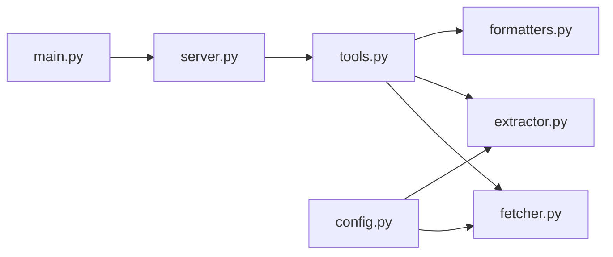

<div align="center">

# 🌐 Amazon Q Web Documentation Reader

### MCP Server for Intelligent Web Content Extraction

[](https://python.org)
[](https://modelcontextprotocol.io)
[](LICENSE)

<p align="center">
  <strong>A Model Context Protocol (MCP) server that enables Amazon Q to intelligently navigate and extract documentation from websites.</strong>
  <br>
  <em>Amazon Q uses Claude 4.5 to make smart decisions about which pages to visit and what content to extract.</em>
</p>

[Features](#-features) •
[Installation](#-installation) •
[Usage](#-usage) •
[Tools](#-available-tools) •
[Configuration](#%EF%B8%8F-configuration) •
[Contributing](#-contributing)

</div>

---

## ✨ Features

| Feature | Description |
|---------|-------------|
| 🧠 **Intelligent Navigation** | Amazon Q (Claude 4.5) decides which documentation pages to visit |
| 🧹 **Clean Content Extraction** | Removes navigation, ads, scripts, and other non-content elements |
| 📝 **Multiple Output Formats** | Supports both Markdown and plain text output |
| 💻 **Code Block Extraction** | Specifically extracts code examples from documentation |
| 📊 **Page Structure Analysis** | Extracts heading hierarchy and table of contents |
| 🔗 **Link Discovery** | Finds and filters documentation links |
| 📚 **Batch Processing** | Read multiple documentation pages at once |

---

## 🎯 How It Works

```
User: "I'm having issues with Razorpay routes"
      Documentation: https://razorpay.com/docs

Amazon Q (Claude 4.5):
  1. Reads main docs page
  2. Sees links: ["Payments", "Routes", "Webhooks", ...]
  3. Intelligently decides: "Routes link is relevant!"
  4. Navigates to Routes documentation
  5. Extracts content and solves your problem

All navigation decisions = Amazon Q's Claude brain 🧠
MCP Server = Clean content extraction tool 🛠️
```

---

## 📁 Project Structure

```
amazon-q-web_search/
├── 📄 main.py              # Entry point
├── 📄 pyproject.toml       # Project configuration
├── 📄 README.md            # This file
└── 📁 src/
    ├── __init__.py         # Package initialization
    ├── server.py           # MCP server initialization
    ├── config.py           # Configuration constants
    ├── fetcher.py          # HTTP fetching logic
    ├── extractor.py        # HTML content extraction
    ├── formatters.py       # Output formatting
    └── tools.py            # MCP tool definitions
```

---

## 📦 Installation

### Prerequisites

- Python 3.12 or higher
- [uv](https://github.com/astral-sh/uv) (recommended) or pip

### Quick Start

**1. Clone the repository:**

```bash
git clone https://github.com/Lumos-Labs-HQ/amazon-q-web_search.git
cd amazon-q-web_search
```

**2. Install dependencies:**

<details>
<summary>Using uv (Recommended)</summary>

```bash
uv sync
```
</details>

<details>
<summary>Using pip</summary>

```bash
pip install -e .
```
</details>

---

## 🚀 Usage

### Running the Server

```bash
# Using Python directly
python main.py

# Using uv
uv run main.py
```

### Configuring with Amazon Q

Add this server to your Amazon Q CLI configuration:

**📍 Configuration file:** `~/.config/amazonq/mcp.json`

<details>
<summary><strong>Using Python</strong></summary>

```json
{
  "mcpServers": {
    "doc_reader": {
      "command": "python",
      "args": ["/path/to/amazon-q-web_search/main.py"]
    }
  }
}
```
</details>

<details>
<summary><strong>Using uv</strong></summary>

```json
{
  "mcpServers": {
    "doc_reader": {
      "command": "uv",
      "args": ["run", "--directory", "/path/to/amazon-q-web_search", "main.py"]
    }
  }
}
```
</details>

---

## 🛠 Available Tools

> **Note**: Amazon Q intelligently chains these tools to navigate documentation and solve your problems. You don't need to call them individually - just describe your problem and provide a documentation URL!

### 1️⃣ `read_web_documentation`

> Fetches and extracts clean documentation content from a web page.

| Parameter | Type | Required | Description |
|-----------|------|----------|-------------|
| `url` | string | ✅ | The URL of the documentation page |
| `output_format` | string | ❌ | Output format: `"markdown"` (default) or `"text"` |

```
💡 Example: Read the documentation from https://docs.python.org/3/library/asyncio.html
```

---

### 2️⃣ `extract_code_examples`

> Extracts all code blocks from a documentation page.

| Parameter | Type | Required | Description |
|-----------|------|----------|-------------|
| `url` | string | ✅ | The URL of the documentation page |

```
💡 Example: Extract code examples from https://fastapi.tiangolo.com/tutorial/first-steps/
```

---

### 3️⃣ `get_page_structure`

> Extracts the heading structure and table of contents from a documentation page.

| Parameter | Type | Required | Description |
|-----------|------|----------|-------------|
| `url` | string | ✅ | The URL of the documentation page |

```
💡 Example: Get the structure of https://docs.aws.amazon.com/lambda/latest/dg/welcome.html
```

---

### 4️⃣ `get_documentation_links`

> Extracts all links from a documentation page with optional filtering.

| Parameter | Type | Required | Description |
|-----------|------|----------|-------------|
| `url` | string | ✅ | The URL of the documentation page |
| `filter_pattern` | string | ❌ | Pattern to filter links (e.g., `"api"`, `"guide"`) |

```
💡 Example: Get all links from https://react.dev/learn containing "hooks"
```

---

### 5️⃣ `read_multiple_docs`

> Reads multiple documentation pages and combines their content.

| Parameter | Type | Required | Description |
|-----------|------|----------|-------------|
| `urls` | array | ✅ | List of documentation URLs (max 10) |

```
💡 Example: Read documentation from multiple Python library pages
```

---

## ⚙️ Configuration

Edit `src/config.py` to customize behavior:

| Setting | Default | Description |
|---------|---------|-------------|
| `HTTP_TIMEOUT` | 30.0s | Request timeout in seconds |
| `MAX_CONTENT_LENGTH` | 500KB | Maximum content size in bytes |
| `USER_AGENT` | Custom | HTTP User-Agent string |
| `REMOVE_TAGS` | Various | HTML tags to remove during extraction |
| `REMOVE_PATTERNS` | Various | CSS class/ID patterns to remove |
| `CONTENT_SELECTORS` | Various | Selectors for finding main content |

---

## 🏗 Architecture

### Module Responsibilities



| Module | Responsibility |
|--------|----------------|
| `server.py` | Initializes the FastMCP server instance |
| `config.py` | Centralized configuration constants |
| `fetcher.py` | Handles HTTP requests with proper headers and error handling |
| `extractor.py` | Contains the `DocumentExtractor` class for parsing HTML |
| `formatters.py` | Formats extracted data for Amazon Q consumption |
| `tools.py` | Defines all MCP tools that Amazon Q uses for navigation |

### Content Extraction Pipeline

```
📥 Fetch → 🔍 Parse → 🧹 Clean → 📄 Extract → 🔄 Convert → 📤 Format
```

1. **Fetch** — HTTP request with proper headers and timeout
2. **Parse** — BeautifulSoup parses HTML into a DOM tree
3. **Clean** — Remove scripts, styles, navigation, ads, etc.
4. **Extract** — Find main content container using common selectors
5. **Convert** — Transform to Markdown or plain text
6. **Format** — Add metadata and structure for Amazon Q

### Intelligent Navigation Flow

```
User Problem + Docs URL
        ↓
Amazon Q (Claude 4.5) decides what to do
        ↓
Calls MCP tools to navigate
        ↓
MCP Server extracts clean content
        ↓
Amazon Q uses content to solve problem
```

---

## 🧪 Development

### Adding New Tools

1. Define the tool function in `src/tools.py`
2. Use the `@mcp.tool()` decorator
3. Add proper docstrings for Amazon Q to understand the tool
4. Handle errors gracefully with user-friendly messages

<details>
<summary><strong>📝 Example Tool Template</strong></summary>

```python
@mcp.tool()
async def my_new_tool(url: str, param: str = "default") -> str:
    """
    Brief description of what the tool does.
    
    Args:
        url: Description of url parameter
        param: Description of optional parameter
    
    Returns:
        Description of return value
    """
    try:
        # Implementation
        return result
    except Exception as e:
        return f"Error: {str(e)}"
```
</details>

### Testing

```bash
# Test server import
python -c "from src import mcp; print('Server:', mcp.name)"

# Test a specific tool
python -c "
from src import mcp
import asyncio

async def test():
    result = await mcp._tool_manager._tools['read_web_documentation'].fn(
        'https://example.com'
    )
    print(result[:200])

asyncio.run(test())
"
```

---

## 📚 Dependencies

| Package | Purpose |
|---------|---------|
| [httpx](https://www.python-httpx.org/) | Async HTTP client for fetching web pages |
| [beautifulsoup4](https://www.crummy.com/software/BeautifulSoup/) | HTML parsing and navigation |
| [lxml](https://lxml.de/) | Fast XML/HTML parser |
| [markdownify](https://github.com/matthewwithanm/python-markdownify) | HTML to Markdown conversion |
| [mcp](https://modelcontextprotocol.io/) | Model Context Protocol SDK |

---

## ⚠️ Limitations

| Limit | Value |
|-------|-------|
| Maximum content size | 500KB per page |
| Maximum URLs per batch | 10 |
| Request timeout | 30 seconds |
| Content type | HTML only |

---

## 🚨 Error Handling

The server gracefully handles:

- ❌ Invalid URLs
- ❌ HTTP errors (404, 500, etc.)
- ❌ Connection timeouts
- ❌ Content too large
- ❌ Parsing failures

All errors return user-friendly messages to Amazon Q.

---

## 📄 License

This project is licensed under the MIT License - see the [LICENSE](LICENSE) file for details.

---

## 🤝 Contributing

Contributions are welcome! Please feel free to submit a Pull Request.

1. Fork the repository
2. Create your feature branch (`git checkout -b feature/AmazingFeature`)
3. Commit your changes (`git commit -m 'Add some AmazingFeature'`)
4. Push to the branch (`git push origin feature/AmazingFeature`)
5. Open a Pull Request

---

## 💬 Support

- 📫 Open an [Issue](https://github.com/Lumos-Labs-HQ/amazon-q-web_search/issues) for bug reports or feature requests
- ⭐ Star this repo if you find it useful!

---

<div align="center">
  <sub>Built with ❤️ by <a href="https://github.com/Lumos-Labs-HQ">Lumos Labs HQ</a></sub>
</div>
